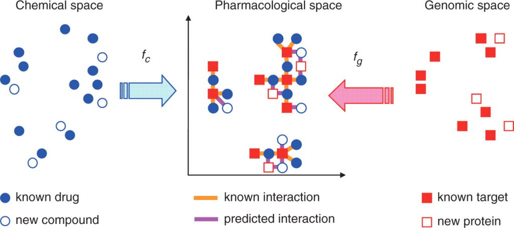
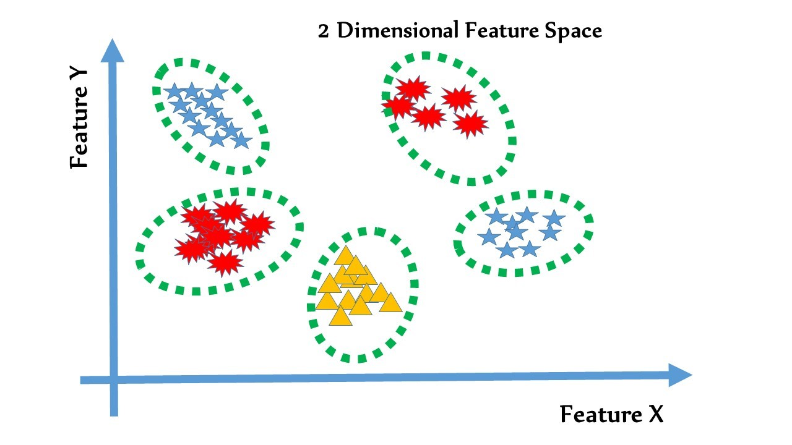

# Chemogenomic Methods

Chemogenomic method는 약물과 타겟 단백질을 특정 공간에 배치시킨 후, 이를 이용해서 상호작용을 예측하는 방법들을 말한다.

이러한 방법론에서는 약물과 단백질은 특정 feature으로 표현되며, 이 feature을 Pharmacological space로 병합하여 약물-표적 상호작용을 예측하게 된다.

$$
DTI_{d_i,t_j}=f_p\big(f_c(d_i),f_g(t_j)\big)
$$

수식으로는 다음과 같이 표현될 수 있으며, 논문마다 각자 다른 약물, 단백질, 상호작용 표현 방법들을 사용할 수 있다.

그림으로 표현하면 다음과 같다.

약물과 단백질이 각각 feature로 변환이 되어 각각 chemical space와 genomic space상에 존재하게 되고, 이를 pharmacological space상으로 매핑함수 \( $$f_c, f_g$$\) 를 이용하여 Pharmacological space상의 DTI쌍으로 표현하는 것을 보여주고 있다. __이렇게 Pharmacological space로 매핑한 후에는 여러 분류기법 \(RF, SVM, KNN 등등\)을 이용하여 상호작용하는 약물-단백질쌍을 학습하고 예측할 수 있게 된다.

Chemogenomic method라는 개념을 처음으로 제시한 [_Yamanishi et al._](https://academic.oup.com/bioinformatics/article/24/13/i232/231871)에서는 다음과 같은 말로 설명을 하며, 약물과 단백질을 각각 유사도 벡터로 표현하고 있다..

> In the proposed method, chemical space means the chemical structure similarity space of possible chemical compounds, genomic space means the amino acid sequence similarity space of possible proteins and pharmacological space means the interaction space reflecting the drug–target interaction network, where interacting drugs and target proteins are close to each other.

이러한 유사도 기반의 기법들이 가지고 있는 근본 가정은 다음과 같다.

> 비슷한 단백질은 비슷한 약물들과 상호작용할 것이며, 마찬가지로 비슷한 약물들은 비슷한 단백질과 상호작용할 것이다.

상호작용하는 약물-단백질 쌍이 분류가 되려면 Pharmacological space가 다음과 같은 형태로 생겼을것이다.

여기서 별, 삼각형 등등은 비슷한 서열을 가진 단백질과, 그 단백질과 상호작용하는 약물 쌍이다. 점선으로 표현된 hyperplane이 상호작용하지 않는 약물-단백질쌍과 상호작용하는 단백질쌍을 분류해주는 것을 확인할 수 있다. 또한, 비슷한 단백질-약물쌍들끼리 그룹화가 되어있어서 pharmacological space상에서 분류선이 여러개가 복잡하게 생성 \(Coarse\) 되어있음을 확인할수있다.

이러한 상황은 일반적으로 machine learning 모델에서 성능 하락 및 오버피팅 문제를 일으킨다. 그렇다면 이런 문제를 어떻게 해결할 수 있을까?

