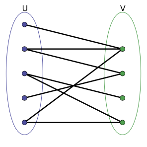
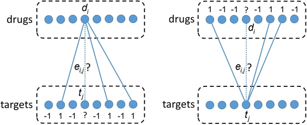
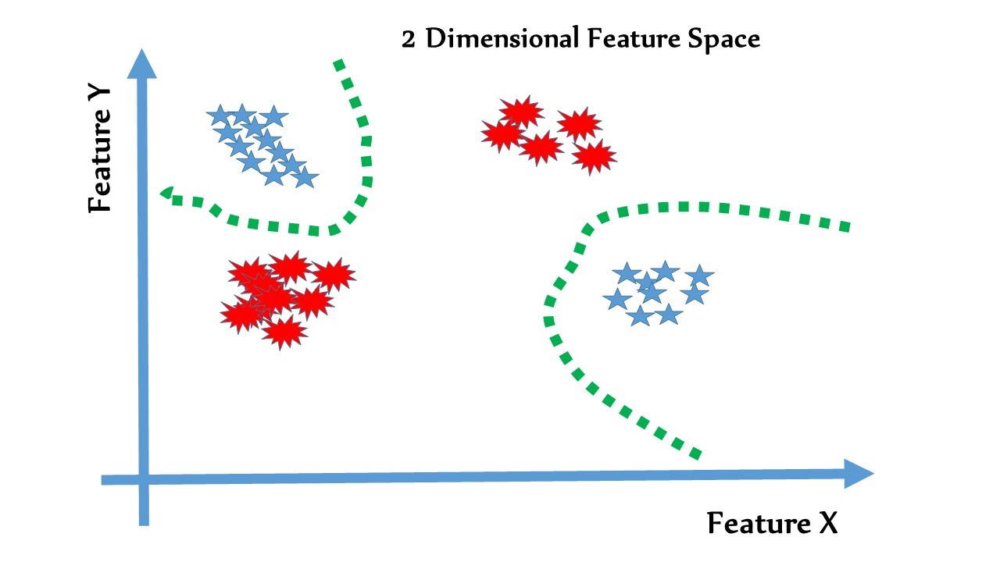

# Bipartite Local Model \(BLM\)

전 문서인, [Chemogenomic Methods](./)에서는 Pharmacological space가 굉장이 복잡\(coarse\)한 hyperplane을 형성할 수 있고, 이로 인해서 예측모델의 성능이 하락할 수 있음을 지적한바 있다.

이러한 문제점을 해결하기 위해서 고안된 모델이 Bipartite Local Model \(BLM\)이다. BLM에서는 DTI 쌍을 Bipartite Graph로 표현한다.

먼저 Bipartite graph에 대해서 알아보자. 

## Bipartite Graph

Bipartite 그래프는 서로 다른 두 그룹 U,V가 있고 U와 V사이에서 edge만이 존재하는 그래프들을 의미한다. 즉 U와 V그룹 내부의 엣지는 존재하지 않는다.

아래와 같은 그림에서 볼 수 있듯이, 약물-단백질 상호작용은 약물 그룹과 단백질 그룹의 Bipartite 그래프로 표현될 수 있다. 

이렇게 약물-단백질 상호작용이 Bipartite 그래프로 표현될 경우에 좋은 점은, 한 그룹내의 노드 입장에서 같은 그룹의 다른 노드를 생각할 필요가 없고\(엣지가 없기 때문에\), 상대 그룹만 신경쓰면 된다는 것이다. 약물-표적 단백질 상호작용 입장에서는 단백질 관점에서는 약물 쪽만 보면 되고, 약물 입장에서는 단백질 쪽만 보면 된다.

## Bipartite Local Model \(BML\)

\_\_[_Bleakley et al._](https://academic.oup.com/bioinformatics/article/25/18/2397/197654) 에서는 이러한 Bipartite 그래프의 특성을 이용하여 Bipartite local model \(BML\)을 만들었다. 위에서 언급하였듯, Bipartite 그래프의 장점은 한 노드 관점에서 상대 그룹만을 신경쓰면 된다는 것이다.

BLM에서는 각각 약물, 그리고 단백질 하나하나 마다 상대 그룹에 대한 분류 모델을 만든다.  
예를 들면, 단백질 a에 대해서 반대 그룹인 약물 그룹들의 약물들을 feature로 표현하고, 이 feature들을 이용해서 단백질 a와 상호작용 알려진 약물들에 대해서는 1로 예측하도록, 아닌 약물들은 -1로 예측하도록 SVM을 학습한다.

그렇다면, 단백질 하나 입장에서 약물 feature로만 분류하게 되므로 분류 공간이 훨씬 덜 복잡하게 만들어지게 된다.

이렇게 하나의 단백질, 혹은 약물의 관점에서 분류모델을 만들기 때문에 Local model 이라고 부를 수 있고, Bipartite 그래프 관점을 적용하였기 때문에, Bipartite Local Model이라고 부르게 된다.

## Reference

1. Buza, Krisztian, Ladislav Peška, and Júlia Koller. "[Modified linear regression predicts drug-target interactions accurately.](https://journals.plos.org/plosone/article?id=10.1371/journal.pone.0230726)" PloS one 15.4 \(2020\): e0230726.
2. Bleakley, Kevin, and Yoshihiro Yamanishi. "[Supervised prediction of drug–target interactions using bipartite local models.](https://academic.oup.com/bioinformatics/article/25/18/2397/197654)" Bioinformatics 25.18 \(2009\): 2397-2403.

