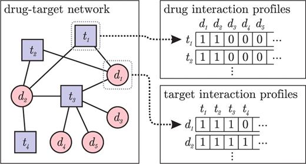
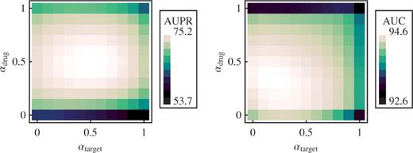

# Gaussian Interaction Profile \(GIP\)

Guassian Interaction Profile은 사실 [LapRLS](laprls-and-netlaprls.md)를 이해했다면 그렇게 어렵지 않은 모델이다.

## Interaction Profile

위와 같이 각각 약물/단백질은 단백질/약물 프로파일을 가지고 있다. 

## Gaussian Interaction Profile

약물 $$i$$ 의 target interaction profile $$y_{d_i}$$ 은 약물 갯수만큼의 크기를 가진 벡터일 것이다.

약물간의 유사도인 Gaussian interaction profile \(GIP\)는 target interaction profile에 [radial basis function \(RBF\)](https://en.wikipedia.org/wiki/Radial_basis_function)을 적용한 것으로 바라본다. 즉 비슷한 타겟을 많이 가질 수록 GIP값은 커진다

$$
K_{GIP,d}(d_i, d_j)=\exp(-\gamma_d||y_{d_i}-y_{d_j}||^2)
$$

GIP는 0과 1사이의 값을 가짐을 알 수 있다.

기존 유사도 행렬에 GIP를 더하여 BLM을 만든다.

$$
K_d = \alpha_dK_{chemical,d}+(1-\alpha_d)K_{GIP,d}
$$

$$
K_p = \alpha_pK_{genomic,d}+(1-\alpha_p)K_{GIP,p}
$$

$$\alpha_d,\alpha_p$$ 는 유저가 세팅해주는 파라미터이다. \(유사도와 GIP의 중요도 조절\). $$\alpha_d=\alpha_p=0.5$$ 일 때, 성능이 제일 좋았다고 한다.

결론적으로 GIP를 추가하였을때 성능이 올랐다고 한다. 유사도 매트릭스를 feature로 하는 것은 성능적인 한계를 보여주고, GIP를 통해 이를 뛰어넘을 수 있었다고 한다.

## Reference

1. van Laarhoven, Twan, Sander B. Nabuurs, and Elena Marchiori. "[Gaussian interaction profile kernels for predicting drug–target interaction.](https://academic.oup.com/bioinformatics/article/27/21/3036/216840)" Bioinformatics 27.21 \(2011\): 3036-3043.

