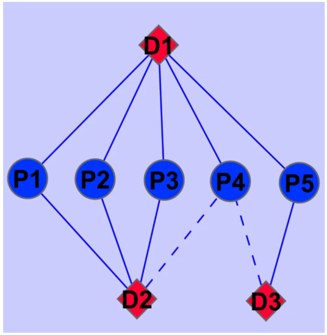

# LapRLS and NetLapRLS

LapRLS는 [BLM](./)에 두가지 요소를 추가하였다. Network similarity와 Larplace regularization이다.

## Network Similarity

먼저 약물과 단백질의 기존 유사도에 공통적으로 가지고 있는 상호작용쌍의 개수인 Network similarity를 추가 하였다. 이를 위해

$$
K_d \in R^{n_d\times n_d}, K_p \in R^{n_p\times n_p}
$$

를 계산하는데, $$K_d, K_p $$ 에서 각각 $$i,j$$ 는 $$j$$에 해당하는 약물/단백질이 $$i$$ 에 해당하는 약물/단백질과 같이 가지고 있는 약물/단백질의 개수가 될 것이다. 이를 이용하여 약물과 단백질의 유사도 매트릭스는

$$
W_d = \frac {\gamma_{d1}S_d+\gamma_{d2}K_d} {\gamma_{d_1}+\gamma_{d_2}},
W_p = \frac {\gamma_{p1}S_p+\gamma_{p2}K_p} {\gamma_{p_1}+\gamma_{p_2}}
$$

로 표현되게 된다.

또한, Network similarity를 추가하였기 때문에 $$K_d, K_p$$ 를 그래프로 해석할 수 있다. 그렇다면 [Laplacian matrix](https://en.wikipedia.org/wiki/Laplacian_matrix)는 다음과 같이 정의될 수 있다.

$$
\Delta_d =D_d-W_d
$$

\(이후 단백질은 따로 작성하지 않겠음.\)

Laplacian Normalization을 하면 다음과 같이 표현되게 된다.

$$
L_d = D_d^{-1/2}\Delta_d D_d^{-1/2}=I_{n_d\times n_d}-D_d^{-1/2}W_d D_d^{-1/2}
$$

일단 Feature가 이렇게 표현될 수 있다고 생각하자.

이 그래프 feature로 약물-표적 단백질을 예측한 결과값을 $$F_d \in R^{n_d\times n_p}$$라고 한다면

$$
F_d=W_d\alpha_d^*
$$

약물 feature인$$W_d$$에 예측 파라미터 $$\alpha_d^*\in R^{n_d\times n_p}$$를 곱한 값으로 표현할 수 있 을 것이다.

예측에 대한 손실함수는

$$
F_d^*=\min_{F_d} J(F_d) = ||Y-F_d||^2_F
$$

가 될 것이다. \( $$||\cdot ||_F^2$$ 은 [Frobenious Norm](https://en.wikipedia.org/wiki/Matrix_norm)인데 그냥 정답을 잘 맞추면 낮춰지는 loss라고 생각하자.\)

## Larplace Regularization

위의 loss텀에 Regularization을 추가하여주는데 다음과 같은 텀을 추가해준다.

$$
\beta_d Trace(F_d^TL_dF_d)=\beta_d Trace(\alpha^T_dW_dL_dW_d\alpha_d)
$$

일견 어려워보이지만, 차근차근 해석해보자. 먼저

$$
F_d^TL_dF_d = F^T_dF_d - F_d^TD_d^{-1/2}W_dD_d^{-1/2}F_d
$$

인것을 알 수가 있는데 $$F_d^TF$$와 $$F_d^TD_d^{-1/2}W_dD_d^{-1/2}F_d$$ 둘다 $$R^{n_p\times n_p}$$ 인것을 알 수 있다. 따라서 $$\beta_d Trace(\alpha^T_dW_dL_dW_d\alpha_d)$$을 최소화 하려면 $$F_d^TF$$ 과 $$F_d^TD_d^{-1/2}W_dD_d^{-1/2}F_d$$ 의 대각요소의 차가 적어지면 될것이다.

$$F_d^TF$$에서 대각요소는 모델이 약물 feature기반으로 예측한 단백질에 대한 스코어의 제곱이다. 예를 들면 $$F_d^TF$$ 의 $$(i, i)$$ 요소는 $$W_d$$ 의 $$i$$ 번째 feature를 이용한 $$||F_i||_2$$ 이다.

$$F_d^TD_d^{-1/2}W_dD_d^{-1/2}F_d$$ 는 $$F_d^TF$$ 에 정규화된 약물 및 네트워크 유사도 정도를 추가한 것이다. 즉, $$F_d^TF$$ 가 유사도로 인하여 weighting된 것이다. $$F_d^TD_d^{-1/2}W_dD_d^{-1/2}F_d$$ 의 $$(i, i)$$ 요소는 $$\frac {1}{d_i} \sum_{j=1}^{n_p}W_{d_{(i,j)}}(F_{d_{(i,j)}})^2$$ 가 될것이다 \( $$d_i $$ 는 노드의 degree이다\).

따라서, 예측 모델이 약물간 유사도를 정확히 반영하면 할수록, 대각요소의 값이 적어짐을 확인할 수 있다. 단순히 $$||Y-F_d||^2_F$$ 를 최소화 하는 것은 모델이 약물간 유사도를 정확히 반영하게 할 수 없다.

해석적인 분석을 해보도록 하자.

$$
||Y-W_d\alpha_d||^2_F + \beta_d Trace(\alpha^T_dW_dL_dW_d\alpha_d)
$$

손실함수를 최소화하기 위하여 파라미터인 $$\alpha_d$$ 로 미분을 하고 되면 그라디언트가 최소화되는 값을 찾자

$$
d\alpha_dJ(F_d)=-W_d(Y-W_d\alpha_d)+\beta_dW_dL_d\alpha_d=0
$$

으로 표현되게 된다. 이 식을 $$\alpha_d$$ 에 대해 정리하면

$$
\alpha_d^*=(W_d+\beta_dL_dW_d)^{-1}Y
$$

모든 항에 $$W_d$$ 를 곱해주면

$$
F^*_d=W_d\alpha_d^*=W_d(W_d+\beta_dL_dW_d)^{-1}Y
$$

이 됨을 확인할 수 있다. 

그런데 사실 식을 잘 보면 [Penrose-moore Inverse Matrix](https://en.wikipedia.org/wiki/Moore%E2%80%93Penrose_inverse)에 regularization 텀인 $$\beta_dL_dW_d$$을 추가 한것임을 확인할 수 있고, 이 regularization 텀이 예측함수가 라플라스 행렬을 포함하고 있어 이를 최적화하면서 네트워크 유사도를 반영하도록 하게 만듬을 알 수있다.

## Reference

1. Xia, Zheng, et al. "[Semi-supervised drug-protein interaction prediction from heterogeneous biological spaces.](https://bmcsystbiol.biomedcentral.com/articles/10.1186/1752-0509-4-S2-S6)" BMC systems biology. Vol. 4. No. 2. BioMed Central, 2010.

