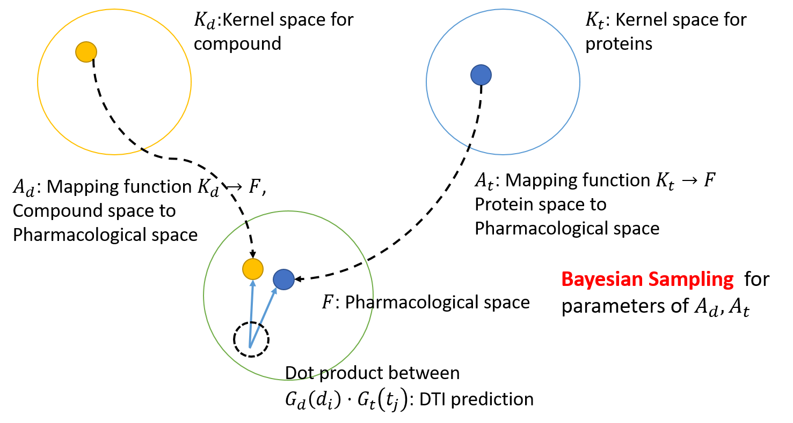
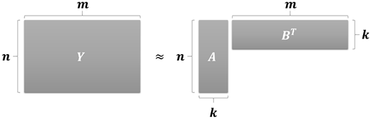
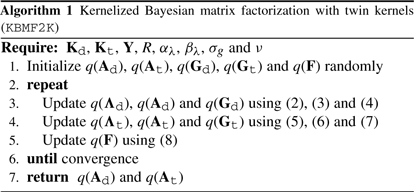
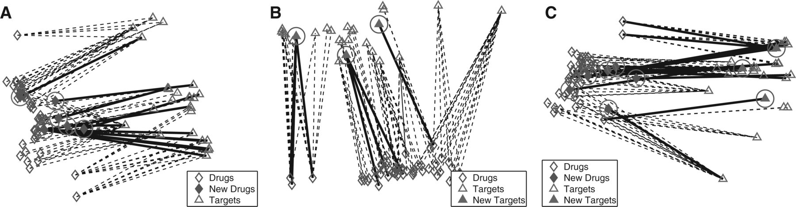

# Kernelized Bayesian matrix factorization with twin kernels \(KBMF2K\)

Kernelized Baysian matrix factorization with twin kernels \(KBM2K\) 는 [Pharmacological space](../pharmacologcial-space.md) 기법을 Matriax Factorization으로 해석한 논문이다.

## Pharmacological Space and Matrix Factorization

KBMBF모델의 개요는 다음과 같다.

먼저, Pharmacological space 기법에서 사용한 방법으로 약물과 단백질을 유사도 커널을 사용하여 약물공간과 단백질 공간 $$K_d,K_t $$ 의 벡터로 표현한다.

그후, 약물과 단백질에 대해서 $$A_d, A_t$$ 인 매핑 함수를 사용하여 약물공간과 단백질 공간에서 Pharmacological space로 매핑한다. 매핑된 Pharmacologcial space상의 약물과 단백질을 $$G_d (d_i), G_t (t_j)$$ 라고 한다.

이후 $$G_d(d_i), G_t(t_j)$$ 간의 pharmacological space상에서의 유사도를 재는데, 이 때 내적을 사용한다. $$F(d_i, t_j)=G_d(d_i)\cdot G_t(t_j)$$ 로 표현될 수 있으며, 이 유사도를 $$\nu$$ 기반의 분류함수를 통하여 1 혹은 -1로 분류하게 된다.

위에 언급된 과정을 $$N_d,N_t$$ 개의 약물과 단백질에 대해서 한번에 수행하는 것은 Matrix muliplication으로 수행할 수 있다. 반대로 예측값을 두개의 별개의 행렬로 만드는 Matrix factorization으로 표현될 수 있다.

$$
F=G_d^TG_t=(A_d^TK_d)^T(A_t^TK_t)=K_d^TA_dA_t^TK_t
$$

위의 과정을 잘 따라온 사람이라면 알겠지만, 사실 모델에 있어서 학습될 수 있는 파라미터는 매핑 함수인 $$A_d, A_t$$ 밖에 없다. KBMF2K는 두함수의 파라미터들에 대해서 베이지언 추론을 하는 방법이다.

## Model and Bayesian Inference

$$A_d,A_t$$ 의 파라미터들을 [감마 분포](https://en.wikipedia.org/wiki/Gamma_distribution)를 사전 확률 분포\(Prior distribution\)으로 가진 사후 확률 분포 \(Posterior distribution\)으로 가정한다. $$A_d,A_t$$ 는 기본적으로 $$\mathbb {N}(0,1)$$ 을 Likelihood로 가지되, 사전 확률 분포로 감마 분포를 [Conjugate piror](https://en.wikipedia.org/wiki/Conjugate_prior)로 가져서 분산의 역인 precision $$\tau$$ 를 감마 분포로부터 샘플링 하는 사후 분포가 된다. 이때 감마 분포의 하이퍼 파라미터 $$\alpha,\beta$$ 는 사용자가 정의해준다.

$$
\lambda_{d,s}^i \sim \mathbb {G}(\lambda_{d,s}^i;\alpha_{\lambda}, \beta_{\lambda}) 
\\ 
\\
a^i_{d,s}|\lambda_{d,s}^i \sim \mathbb {N}(a^i_{d,s};0, (\lambda_{d,s}^i)^{-1})
$$

단백질은 $$d\rightarrow t$$ 로 바꾸면 된다.

위의 사후 분포 $$A_d,A_t$$ 를 기반으로 $$G_d,G_t$$ 는 다음과 같이 정의 될 수 있다.

$$
g_{d,i}^s|a_{d,s},k_{d,i}\sim \mathbb{N}(g_{d,i}^i; a_{d,s}^T k_{d,i}, \sigma^2_g)
$$

$$G_d,G_t$$ 를 기반으로 $$F$$ 는 다음과 같이 정의 될 수 있다.

$$
f^i_j|g_{d,i},g_{t,j} \sim \mathbb {N}(f^i_j;g_{d,i}^Tg_{t,j}, 1)
$$

### Variational Inference \(변분 추론\)

우리의 목표는 입력값 $$k_{d,i},k_{t,j}$$ 으로부터 $$Y$$ 를 예측하는 확률값을 최대화 하는 것이다. 이 때, $$\Theta: \Lambda_d, \Lambda_t$$ \(사전 분포 세트\)이고 $$\Xi:A_d,A_t,G_d,G_t$$ \(나머지 변수들\)이다.

$$
\log {\int p(Y|K_d,K_t)}p(\Theta,\Xi)d(\Theta,\Xi)
$$

그러나, 이 때 필요한 $$A_d, A_t$$ 에 대한 사후확률 분포는 감마분포와 정규분포가 곱하진 감마 정규분포 이기때문에 너무 구하기가 힘들다. 따라서 사후 확률들은 다루기 쉬운 확률분포 $$q$$ 로 근사하게 된다.

$$
q(z)\sim p(z|x)=\frac {p(x|z)p(z)} {p(x)}
$$

이는, 근사 분포 $$q(z)$$와 $$p(z|x)$$ 의 KL-divergence를 최소화 하는 방식으로 진행되게 된다. 즉,$$D_{KL}(q(z)||p(z|x))$$를 최소화 하는 것이다.

$$
D_{KL}(q(z)||p(z|x)) = \int q(z)\log \frac {q(z)} {p(z|x)} dz = D_{KL}(q(z)||p(z))+\log p(x) - \int q(z)\log p(x|z)dz
$$

이 되게 된다. \(자세한 내용은 [변분 추론](../../../machine-learning/variational-inference.md) 참조.\)

### Variational Inference with Monte Carlo Sampling

그러나 현실은 위의 식을 계산하는 것도 상당히 어렵다. 따라서 위의 적분값을 근사하기 위하여 충분히 큰 횟수로 $$z$$ 를 샘플링 하여 $$q(z)$$ 를 근사하는데 이를 몬테 카를로 샘플링 이라고 한다.

$$
D_{KL}(q(z)||p(z)) - \int p(x|z) q(z)dz + \log p(x) = E_{z\sim q(z)}\big [ \log q(z)-\log p(z) - \log(x|z) \big ] + \log p(x)
$$

이를 몬테 카를로 샘플링 을 통하여 

$$
\frac {1} {K} \sum_{i=0}^K \big [ \log q(z_i)-\log p(z_i) - \log(x|z_i) \big ]_{z_i \sim q(z)} + \log p(x)
$$

$$q(z)$$ 를 추론할 수 있다.

### Stochastic Variational Inference \(SVI\)

Stochastic Variational Inference 는 그라디언트를 줄이는 방식으로 파라미터를 최소화 함으로써 Variational inference를 수행하는 방법이다.

먼저 $$\Lambda_d,\Lambda_t$$ 를 살펴보자. $$A_d, A_t$$ 는 분산의 역인 precision을 [감마분포](https://en.wikipedia.org/wiki/Gamma_distribution)로부터 추출하는 [Normal gamma distribution](https://en.wikipedia.org/wiki/Normal-gamma_distribution)이다.

감마 정규 분포에서는 정규분포의 분산의 역인 precision이 감마분포 $$\tau$$에 파라미터인 $$\lambda$$ 를 곱해준 것으로 나타낸다. \($$\frac {1} {\sigma^2}=\lambda\tau$$ \). 그런데 여기선 람다는 1이다

shape와 scale 파라미터 $$\alpha,\beta$$ 를 가진 감마 분포와 정규분포의 곱은 다음과 같이 표현할 수 있다.

$$
\bigg\{\frac {1} {\beta^\alpha \Gamma(\alpha)}\tau^{\alpha -1}e^{-\frac {\tau} {\beta}} \bigg \} \bigg \{ \frac {
\tau^{\frac {1} {2}}} {\sqrt {2\pi}} e^{ \tau \frac {(x-\mu)^2} {2}}  \bigg \} = \frac {1} {\beta^\alpha \Gamma(\alpha)\sqrt{2\pi}}\tau^{\alpha -\frac {1} {2}}e^{-\frac {\tau} {\beta}} e^{ \tau \frac {(x-\mu)^2} {2}}
$$

이 떄, $$A_d,A_t$$ 에대한 그라디언트는 미분의 체인룰에 의하여,

$$
\frac {\partial} {\partial \tau} A_d= \frac {\partial A_d (\tau)} {\partial \Lambda_d(\tau)}\frac {\partial \Lambda_d(\tau)} {\partial \tau}
$$

로 표현될 수 있다. 그런데 $$\frac {\vartheta A_d (x)} {\vartheta \Lambda_d(x)}$$ 은 감마 정규 분포에서 감마 분포를 제외한 것이라서 정규분포이고, $$\frac {\vartheta \Lambda_d(x)} {\vartheta x}$$ , 즉 감마분포의 [도함수는 감마분포이다](https://towardsdatascience.com/gamma-distribution-intuition-derivation-and-examples-55f407423840). 따라서 $$\frac {\vartheta} {\vartheta \tau} A_d$$ 는 감마 정규분포 그자체이다. 따라서 아래와 같은 확률을 최대화 하도록 Stochastic하게 파라미터를 줄여나가면 되는 것을 알 수 있는데,

$$
p(\Lambda_d)= \prod_{i=1} ^{N_d} \prod _{s=1}^{S} \mathbb {G}\bigg(\lambda_{d,s}^i;\alpha_{\lambda}+\frac {1} {2}, (\frac {1} {\beta } + \frac {\lambda (x-u)^2} {2} \bigg )
$$

$$\alpha_{\lambda} -1 +\frac {1} {2} +1 = \alpha_{\lambda} + \frac {1} {2}$$ 이 되게 된다. \(유도해보기 바란다\)

$$x$$ 를 몬테카를로 샘플링을 통하여 샘플링하여 변분추론하게 되면,

$$
q(\Lambda_d)= \prod_{i=1} ^{N_d} \prod _{s=1}^{S} \mathbb {G}\bigg(\lambda_{d,s}^i;\alpha_{\lambda}-\frac {1} {2}, (\frac {1} {\beta } + \frac {\widetilde {(a_{d,s})^2}} {2} \bigg )
$$

로 추정하여 감마함수의 확률 값을 최대화하도록 하면 된다. 이 때, $$\widetilde {(a_{d,s})^2}$$ 는 몬테카를로 샘플링값이다.

같은 방식으로 이후, $$A_d, A_t, G_d,G_t$$ 등도 최적화 할 수있다.

$$
\frac {\partial} {\partial x} A_d= \frac {\partial G_d (x)} {\partial A_d(x)}\frac {\partial A_d(x)} {\partial x}
$$

인데, 여기서 중요한 점은 정규분포의 도함수는 다음과 같다는 것이다.

$$
\frac {\partial } {\partial x}\mathbb {N}(x;\mu,\sigma)=\frac {-(x-\mu)}{\sigma^2} \mathbb {N}(x;\mu,\sigma)
$$

이를 기반으로 그라디언트를 계산하면

$$
p(A_d)=\prod_{s=1}^{R}\mathbb {N}\bigg ( a_{t,s}; K_t G_d\frac {1} {\sigma^2} +0, \big(diag(\lambda_t^s)+\frac {K_dK_d^T} {\sigma^2} \big)^{-1} \bigg)
$$

이다. 여기서 $$0$$이 포함된 이유는, $$a_{d,s}^i|\lambda_{d,s}^i \sim \mathbb {N}(a_{d,s}^i;0, (\lambda_{d,s}^i)^{-1})$$ 로, $$a_{d,s}^i$$ 의 평균이 $$0$$ 이기 때문이다. 또한 분산은 커널의 공분산과 감마분포의 분산의 조화평균이 되게 된다. 여기서 몬테카를로 샘플링을 통해 변분 추론을 하게 되면,

$$
q(A_d)=\prod_{s=1}^{R}\mathbb {N}\bigg ( a_{t,s}; K_d G_d\frac {{\textstyle \sum} (a_{t,s})} {\sigma^2}, \big(diag(\widetilde {\lambda_t^s})+\frac {K_dK_d^T} {\sigma^2} \big)^{-1} \bigg)
$$

이 되게 되는데. 감마 분포로 부터 샘플링된 $$\widetilde {a_{d,s}^i}$$ 의 공분산과 $$K_d$$ 의 곱으로 정규분포 $$G_d$$ 의 평균을 샘플링하게 되고, 마찬가지로 감마분포로부터 precision을 샘플링하여 조화평균의 추정에 사용하게 된다.

마지막으로, $$G_d, G_t$$ 에 관련해서도

$$
\frac {\partial} {\partial x} G_d= \frac {\partial F(x)} {\partial G_d(x)}\frac {\partial G_d(x)} {\partial x}
$$

이므로,

$$
p(G_d) = \prod_{i=1}^{N_d}\mathbb {N}\bigg( g_{d,i}; G_t(f^i)^T + \frac {G_{d,i}} {\sigma_g^2}, \big (\frac {I} {\sigma_g^2}+G_tG_t^T \big)^{-1}\bigg)
$$

이고 여기에 변분추론을 하게 되면 다음과 같이 될 것이다.

$$
p(G_d) = \prod_{i=1}^{N_d}\mathbb {N}\bigg( g_{d,i}; {\textstyle \sum} (g_{d,i}) \big( \widetilde {G_t} \widetilde {(f^i)^T} + \frac {\widetilde {A_d^T}k_{d,i}} {\sigma_g^2} \big ), \big (\frac {I} {\sigma_g^2}+\widetilde {G_tG_t^T} \big)^{-1}\bigg)
$$

위와 마찬가지로, 샘플링된 $$\widetilde {a_{d,s}^i},\widetilde {a_{t,s}^i}$$ 를 기반으로 하여 $$\widetilde {G_d}, \widetilde {(f^i)^T}, \widetilde {G_t}$$ 를 추정할 수 있다.

위의 그라디언트 디센트를 각각 변분추론값이 수렴할때까지 반복하면 된다.

이를 논문에서는 다음과 같이 표현하고 있다.

## Visualization of Pharmacological Space

논문에서는 90%의 약물, 단백질, 상호작용으로 학습을 시키고 나머지 10%를 사용하여 테스트 하였다. Pharmacological space에 $$A_d, A_t$$ 를 이용하여 2차원 pharmacological space에 프로젝션\(매핑\)하면 다음과 같이 보이게 된다.

점선은 학습에 사용된 상호작용이고 실선은 새로운 상호작용이다. 새로운 약물, 단백질이 Pharmacological space에 잘 매핑 되는 것을 볼 수있다.

## References

1. Gönen, Mehmet. "[Predicting drug–target interactions from chemical and genomic kernels using Bayesian matrix factorization.](https://academic.oup.com/bioinformatics/article/28/18/2304/241817)" Bioinformatics 28.18 \(2012\): 2304-2310.
2. Ezzat, Ali, et al. "[Computational prediction of drug–target interactions using chemogenomic approaches: an empirical survey](https://academic.oup.com/bib/article-abstract/20/4/1337/4824712)." Briefings in bioinformatics 20.4 \(2019\): 1337-1357.

