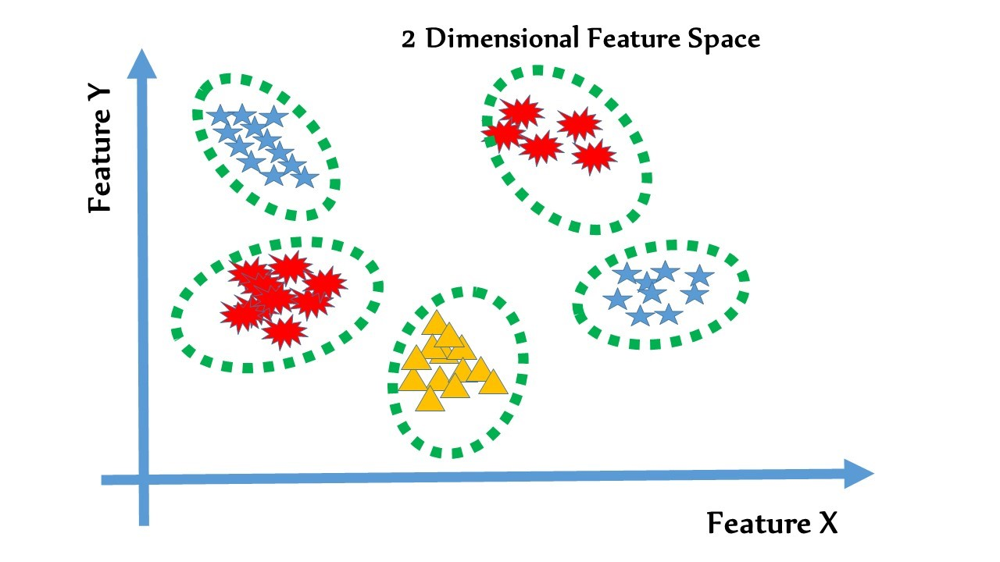

# Pharmacologcial Space

Pharmacological Space라는 개념을 처음으로 제시한 [_Yamanishi et al._](https://academic.oup.com/bioinformatics/article/24/13/i232/231871)에서는 다음과 같은 말로 설명을 하며, 약물과 단백질을 각각 유사도 벡터로 표현하고 있다..

> In the proposed method, chemical space means the chemical structure similarity space of possible chemical compounds, genomic space means the amino acid sequence similarity space of possible proteins and pharmacological space means the interaction space reflecting the drug–target interaction network, where interacting drugs and target proteins are close to each other.

이러한 유사도 기반의 기법들이 가지고 있는 근본 가정은 다음과 같다.

> 비슷한 단백질은 비슷한 약물들과 상호작용할 것이며, 마찬가지로 비슷한 약물들은 비슷한 단백질과 상호작용할 것이다.

그렇다면, 단백질과 약물의 유사도는 어떻게 측정할까?

## 유사도 측정 및 유사도 벡터

단백질의 경우, 전통적으로 두 단백질의 유사도는 [Smith-Waterman Algorithm \(SW\)](../../protein-modeling/similarity-measure-of-protein/smith-waterman-algorithm-sw.md)를 이용한다. 다만, SW의 경우 일치하는 비율이 얼마나 큰지가 상관없이 매칭되는 subsequence의 길이가 길어질수록 커지므로. 두 시퀀스 간의 매칭 비율을 고려하는 Normalizetd Smith-Waterman algorithm을 유사도 값으로 사용한다.

$$
S_p(p,p')=\text {NormSW}(p,p') = \frac {SW(p,p')} {SW(p,p)\cdot SW(p',p')}
$$

약물의 경우는 Chemical fingerprint의 유사도인 [Tanimoto coefficient](../../compound-modeling/similarity-measure-of-compound/tanimoto-coefficient.md)를 사용한다.

## 유사도를 이용한 Drug-Target Interaction \(DTI\) 예측

### Nearest Profile

이렇게 유사도를 구할 수 있다면, 새 타겟 단백질이나 새 약물에 대해서 가장 비슷한 기존의 타겟 단백질이나 약물을 찾고 상호작용 하는 쌍에 유사도를 곱함으로써 새로운 DTI의 interaction score를 예측하는 간단한 모델을 생각해 볼 수 있다. 새 약물과의 상호작용에 대해서는,

$$
x_{c_{new}} =  S_c(c_{new}, c_{nearest})X_{c_{nearest}}
$$

반면, 새 타겟 단백질과의 상호작용에 대해서는

$$
Y_{g_{new}} = S_g(g_{new}, g_{nearest})Y_{g_{nearest}}
$$

를 이용하여 예측할 수 있다.

그렇다면 단백질 $$n_p$$개와 약물 $$n_d$$ 유사도 행렬을 다음과 같이 만들 수있다.

$$
S_p = \begin{pmatrix}
 S_p(p_1, p_1)& S_p(p_1, p_2)  & \cdots  & S_p(p_1, p_{n_p-1})  & S_p(p_1, p_{n_p})\\ 
 S_p(p_2, p_1)& S_p(p_2, p_2)  & \cdots  & S_p(p_2, p_{n_p-1})  & S_p(p_2, p_{n_p})\\ 
\vdots & \vdots  & \ddots   &\vdots  &\vdots \\ 
 S_p(p_{n_p-1}, p_1)&S_p(p_{n_p-1}, p_{n_p})  & \cdots  & S_p(p_{n_p-1}, p_{n_p})  & S_p(p_{n_p-1}, p_{n_p})\\ 
 S_p(p_{n_p}, p_1)&S_p(p_{n_p}, p_{n_p})  & \cdots  & S_p(p_{n_p}, p_{n_p})  & S_p(p_{n_p}, p_{n_p})
\end{pmatrix}
$$

### Weighted Profile

다만, 이런 모델은 가장 비슷한 타겟 단백질이나 약물 하나만 고려하기 때문에 성능이 떨어진다 \(KNN에서 K가 1일때를 생각해보자\). 이러한 단점을 보완하기 위해서 모든 타겟 단백질이나 약물에 대해서 유사도를 구하고 이 유사도를 정규화한 뒤 더하여 \(Weighted sum\) Interaction score를 구하는 방법이 있다.

$$
Y_{new} = \frac {1} {Z_{g_{new}}}\sum^{n_g}_{j=1}S_g(g_{g_{new}}, g_j)y_{g_j}
$$

여기서 $$Z_{g_{new}}$$ 는 새 타겟 단백질과 기존의 모든 단백질에 대한 유사도의 합으로써, normalization constant라고 생각할수 있다. 이 모델은 가장 비슷한 단백질뿐만이 아니라 모든 단백질의 값을 고려하되, 유사도로 인해 고려하는 수준을 정함으로써 보다 정교한 예측을 수행할 수 있게 해준다.

## Bipartite Graph Learning

 위와 같은 Weightewed Profile 방법도 문제점이 있다. 근본적인 문제점은, 유사도 값이 Interaction score를 쉽게 구분할 수 있을만큼 크게 **“매끄럽지”** 못하다는 점이다. _Yamanishi et. al_ 에서는 약물, 타겟 단백질, 상호작용을 통합하는 Bipartite 그래프를 커널화 시키고 Similarity값을 매핑 시킴으로써 해결한다.

먼저 약물, 단백질, 상호작용 Bipartite 그래프를 이용하여, Kernel matrix K를 만든다.

$$
K_{ij}=\exp(-d_{ij}^2/h^2)
$$

이 때,  $$d$$ 는 각각 약물 또는 타겟 단백질이 될수 있는 $$i,j$$ 의 bipartite 그래프 상에서의 거리이다. 그래프에서 닿을 수 없을 경우 무한대로 설정해준다 \($$\exp(-\infty)=0$$ \). $$h$$ 는 width 파라미터이다\(너무 신경쓰지 말자\).

그래프상의 거리에 가우시안 커널을 씌웠는데, 이러면 그래프상에서의 거리 문제에서 interaction이 있는지 없는지 더 잘 판별해주도록 매핑된다고 생각 할 수 있다. Kernel은 Positive semi-definite해야 되기 때문에, Identity matrix를 적절히 더해준다

그렇다면, 여태까지 위의 방법에선 유사도값을 이용하여 예측하였는데, 유사도 값을 이용하여 예측할 수 있도록 유사도를 만들어진 커널에 매핑을 시키면 된다. 커널을 고유값 분해를 통해서 $$\Gamma \Lambda^{1/2}\Lambda^{1/2}\Gamma$$ 로 생각하고 $$U=\Gamma\Lambda^{1/2}$$ 로 생각하자. 그러면 유사도를 커널에 매핑시키는 방법은 다음과 같은 손실함수

$$
L=||UU^T-SWWS^T||^2_F
$$

를 Weight vector $$W$$ 를 최적화하여 최소화 하면 될 것이다. 학습은 각각 약물과 타겟 단백질에 대해서 따로 $$W$$ 를 학습한다.

새로운 약물에 대한 pharmacological vector는 다음과 같이 계산된다.

$$
u_{c_{new}}=\sum_{i=1}^{n_c}S_c(c_{new},c_i)w_{c_i}
$$

새로운 단백질에 대한 pharmacological vector는 다음과 같이 계산된다.

$$
u_{p_{new}}=\sum_{i=1}^{n_p}S_p(p_{new},p_i)w_{p_i}
$$

Interaction score는 약물의 pharmacological vector와 타겟 단백질의 pharmacological vector의 inner product로 정의 되는데,

$$
corr(c,p)=u_c\cdot u_g
$$

inner product가 크다는 곧 공간상의 거리가 가깝다는 뜻이므로, pharmacological space상에서 상호작용을 하는 약물-표적 단백질쌍이 가까운 공간에 모이도록 학습을 하였다고 생각할 수 있다.

결론적으로, 이렇게 Bipartite graph를 커널화하고 Similarity 그래프에 커널에 매핑 시킴으로써

* 약물과 타겟 단백질을 같은 pharmacological space에 매핑하였으며
* Pharmacological space에서 상호작용하는 약물과 타겟 단백질이 비슷한 위치를 갖게 함으로써 좀더 “매끄럽고” 판별력이 있는 판별능력을 가질 수 있게되었다.

## Pharmacolgical Space의 중요성과 한계점

상호작용하는 약물-단백질 쌍이 분류가 되려면 Pharmacological space가 다음과 같은 형태로 생겼을것이다.

여기서 별, 삼각형 등등은 비슷한 서열을 가진 단백질과, 그 단백질과 상호작용하는 약물 쌍이다. 점선으로 표현된 hyperplane이 상호작용하지 않는 약물-단백질쌍과 상호작용하는 단백질쌍을 분류해주는 것을 확인할 수 있다. 또한, 비슷한 단백질-약물쌍들끼리 그룹화가 되어있어서 pharmacological space상에서 분류선이 여러개가 복잡하게 생성 \(Coarse\) 되어있음을 확인할수있다.

이러한 상황은 일반적으로 machine learning 모델에서 성능 하락 및 오버피팅 문제를 일으킨다. 그렇다면 이런 문제를 어떻게 해결할 수 있을까?

## 참조논문

1. Yamanishi, Yoshihiro, et al. "[Prediction of drug–target interaction networks from the integration of chemical and genomic spaces.](https://academic.oup.com/bioinformatics/article/24/13/i232/231871)" Bioinformatics 24.13 \(2008\): i232-i240.

