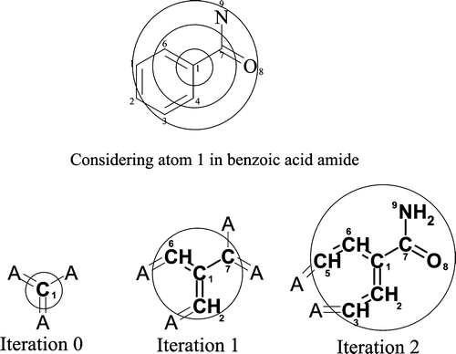
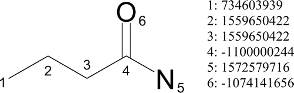
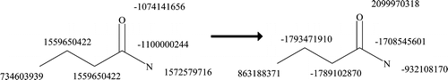
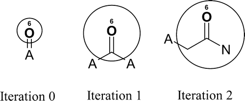
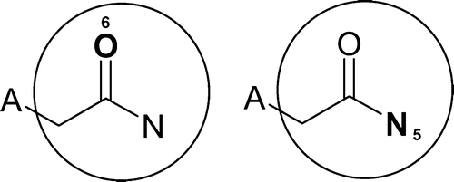
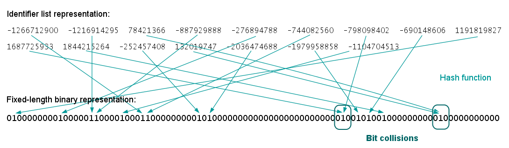
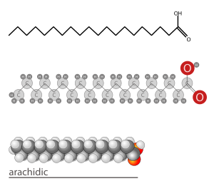

# Extended-Connectivity Fingerprints \(ECFP\)

ECFP는 Chemical fingerprints들 중 PubChem Fingerprint와 함께 가장 많이 사용되는 fingerprint이다.

ECFP는 화합물을 그래프로 표현하며 노드간의 거리를 이용하여 fingerprint를 만든다. 이렇게 노드간의 거리를 이용했을때 각각 substructure가 radius로 표현될 수 있다. 따라서 ECFP는 radius-based fingerprint의 일종이다.

## ECFP Generation



ECFP의 생성과정은 다음과 같다.

1.  _Initial alignment stage_. 각각 원자마다 id 값을 부여하는 단계
2. _Iterative updating stage_. 각각 원자마다 그래프상의 이웃 노드들을 이용하여 부여받은 값을 업데이트 시키는 단계.
3. _Duplicate identifier removal stage_. 업데이트된 값들 중 중복값들을 하나로 표현해주고 이를 이용하여 Fingerprint로 변환해주는 단계

로 총 3가지 단계를 거치게 된다.

위의 그림에서 볼수 있듯, 하나의 원자로부터 iteration을 할때마다 원래 원자로부터 그래프 상에서 1칸씩 떨어진 원자들을 살펴보게 되고 \( $$C_1 \rightarrow (C_6, C_2,C_7)\rightarrow(C_5, C_3, N_9, O_8)$$ \) 이게 원쳐럼 퍼져 나가서 radius라고 부르게 된다.

각각 단계에 대한 설명을 하도록 하겠다.

### Initial Alignment Stage



[SMILES](../simplified-molecular-input-line-entry-system-smiles.md)에서 Atom invariants들을 계산하듯이 화합물내의 모든 원자들에 대해서 이런 특정값을 매겨준다. Daylight atomic invariant들을 이용하는데 다음과 같은 속성들을 이용해 만들어준다.

* 결합되어 있는 Heavy atom의 갯수
* 원자가\(valence\) - 수소 원자 갯수
* 원자 번호
* 원자 무게
* 원자 전하 \(Atomic charge\)
* 수소 개수
* 고리 안에 포함되어있는지 여부

이를 해싱 함수를 이용하면 위의 그림과 같은 값\(id\)들이 각각 원자마다 부여되게 된다.

### Iterative Updating Stage

위에서 언급하였던 대로,  각각 원자들에 대해서 기존에 부여된 id들을 Iterative하게 주변 원자들값을 이용하여 업데이트시키는데, 그 방법은 다음과 같다.

1. Iteration 숫자와 기존 id를 가진 어레이를 만들어준다. \(여기서 어레이는 자료구조의 어레이를 말함\)
2. 붙어있는 원자들을 가져오고 결합 차수\(bond order\)를 이용하여 정렬하여준다. 
3. 정렬된 순서대로 결합차수와 그 원자의 id를 붙여서 어레이를 만들어준다.
4. 이성질체를 표기하는 옵션이 있을경우 이성질체인지 아닌지 표기해서 붙여준다.
5. 위의 어레이를 해싱 함수를 이용하여 새로운 값으로 만들어준다.

위의 과정을 iteration 횟수만큼 반복하여 준다.



예를 들면 -11000000224의 id를 가진 탄소 원자 $$C_4$$ 에 대해서 첫번째 iteration은 $$[1, -1100000244]$$ \(iteration 수준, id\)가 된다. 그리고 주변 원자들을 결합차수를 이용해서 붙이면 $$[1,-1100000244, 1, 1559650422, 1, 1572579716, 2, -1074141656]$$ 인 8 길이의 어레이가 된다. 여기에 대해서 해싱 함수를 적용하면 $$h_{32}([1,-1100000244, 1, 1559650422, 1, 1572579716, 2, -1074141656])=-1708545601$$ 의 새로운 id를 얻게 된다. 위에서 언급하였듯, iteration 횟수가 얼마나 먼 원자들까지 고려하는지 결정하게 된다. 이는 아래와 같은 그림으로 표현된다.



이처럼 iteration마다 고려하는 범위를 원으로 표현할수 있고 radius로 표현할 수 있다. 또한, iteration 과정마다 id들을 버리지 않고 저장한다.

### Duplicate Identifier Removal Stage



그런데 이런 식으로 raius를 그려나가다 보면 같은 범위가 다른 원자들로 표현될 수 있음을 알 수 있다. \( $$O_6$$ 과 $$N_5$$ 의 범위가 같음\). 이러한 중복이 발생할 때, 다음과 같은 기준으로 하나를 버린다.

* iteration 횟수가 다를 경우, 더 iteraction 횟수가 더 많은 id를 버린다.
* iteration 횟수가 같을 경우, 해싱함수를 거친 결과가 더 큰 id를 버린다.

그리고 이렇게 나온 ID값들은 해싱함수를 이용하여 특정 길이의 array에 대한 index값으로 바꾸어줄수 있고 해당 인덱스를 1값으로 바꾸어준다. 이를 Folding이라고 한다.



이렇게 특정 길이의 0 어레이에 각각 하부구조가 1로 표기 된것이 ECFP라고 할 수 있다. 

## 한계점과 의의

ECFP는 PubChem Fingerprint와 함께 가장 많이 쓰이는 Fingerprint로써,  radius보다 작거나 같은 크기의 하부구조들을 어레이 상의 인덱스로 표기한다. 따라서 화합물이 가지고 있는 특정 크기 이하의 모든 하부구조들이 대부분 표현된다는 강력한 강점을 가지고 있다. 또한, 이 이진\(binary\)한 표현을 다양한 길이로 하기 때문에 머신러닝 모델들의 입력으로 아주 좋다. 그래서, 초기 인공신경망 모델들은 ECFP + Random Forest 모델들의 성능을 이기지 못하였다.

이렇게 좋은 ECFP지만 몇몇 문제점을 가지고 있는데,  이는 ECFP의 해싱함수로부터 존재한다. 첫번째는 ECFP 해싱상의 Collision 문제를 들 수 있다. Iteration 상에서 사용하는 해싱함수는 32-bit사이즈를 가지고 있어서 randomly uniform으로 콜리전이 거의 일어나지 않는다곤 하지만, folding단계에서는 보통 512, 1024, 2048같은 길이의 binary 벡터를 사용하게 되므로 folding상에서 collision이 일어날 확률이 높아지게 된다. 경우에 따라서 다른 화합물이 같은 ECFP를 가질 수 있게 된다.

위와 비슷한 이유로써, ECFP로는 원래 화합물을 복원할 수 없다. ECFP 생성과정에서 여러번의 해싱을 거치게 되므로 같은 화합물은 같은 ECFP로 매핑되지만 ECFP를 통해서 원래 화합물을 복원할 수 없는 것이다. 다만 하부구조의 인덱스값을 통하여 huristic하게 어느정도 찾아낼 수 있긴하다.



마지막으로, Radius가 겹쳐짐으로써 생기는 중복이 아니라, 같은 하부구조가 계속 반복되는 경우에 같은 id를 여러개 가지게 되므로 Folding과정에서 하나의 인덱스로 매핑되게 된다. 에를 들면, 지방산 같은경우 꼬리의 길이에 상관없이 같은 Fingerprint를 가지게 될것이다.

## Code

ECFP와 80퍼센트 이상의 correlation을 가지는 RDKit에서의 Morgan/Circular fingerprint의 구현에 대한 코드를 적었다.

```python
from rdkit import Chem
from rdkit.Chem import AllChem
m = Chem.MolFromSmiles("Cc1ccccc1") # Mol object 만들기
fp = AllChem.GetMorganFingerprint(m1, 2, nBits=1024) # Mol로부터 1024길이의 radius 2 핑거프린트 생성
fp_bitvec = AllChem.AllChem.GetMorganFingerprintAsBitVect(m1,2,nBits=1024) # Numpy array로 생성함.
```

출처: [https://www.rdkit.org/docs/GettingStartedInPython.html](https://www.rdkit.org/docs/GettingStartedInPython.html)

## References

1. Rogers, David, and Mathew Hahn. "[Extended-connectivity fingerprints.](https://pubs.acs.org/doi/abs/10.1021/ci100050t)" Journal of chemical information and modeling 50.5 \(2010\): 742-754.

