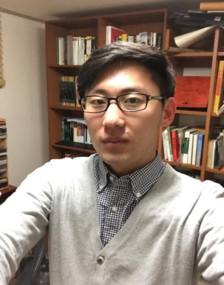

# Curriculum Vitae

Ingoo Lee

Ph.D candidate in Gwangju Institute of Sicence and Technology

## Education

* Interdisciplinary studies in Konkuk university
* Computational systems biology in Gwangju Institute of Science and Technology

## Publication

1. Lee, Ingoo, and Hojung Nam. "[Identification of drug-target interaction by a random walk with restart method on an interactome network.](https://bmcbioinformatics.biomedcentral.com/articles/10.1186/s12859-018-2199-x)" BMC bioinformatics 19.8 \(2018\): 9-18.
2. Lee, Ingoo, Jongsoo Keum, and Hojung Nam. "[DeepConv-DTI: Prediction of drug-target interactions via deep learning with convolution on protein sequences.](https://journals.plos.org/ploscompbiol/article?id=10.1371/journal.pcbi.1007129)" PLoS computational biology 15.6 \(2019\): e1007129.
3. Kim, Hyunho, et al. "[Artificial Intelligence in Drug Discovery: A Comprehensive Review of Data-driven and Machine Learning Approaches.](https://link.springer.com/article/10.1007/s12257-020-0049-y)" Biotechnology and Bioprocess Engineering 25.6 \(2020\): 895-930.

## Contact

[dlsrnsladlek@gist.ac.kr](mailto:dlsrnsladlek@gist.ac.kr)

