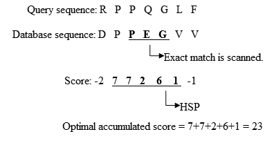

# Basic Local Alignment Search Tool \(BLAST\)

BLAST는 [SW 알고리즘](smith-waterman-algorithm-sw.md)을 기반으로 대규모 데이터베이스로부터 입력한 단백질과 비슷한 단백질을 찾는 알고리즘이다.

## 알고리즘

알고리즘은 다음과 같이 구성된다.

먼저, 입력\(쿼리\) 시퀀스로부터 k-mer들을 뽑아낸다.

이렇게 쿼리 시퀀스부터 가능한 모든 k-mer들을 구하고, 이 k-mer와 비슷한 k-mer들을 BLOSUM을 이용한 스코어를 통하여 구하는데, 가능한 $$20^k$$ 의 조합 중, threshold $$T$$ 보다 큰 k-mer들을 추려낸다. 이를 seed라고 한다.

이 시드를 가지고 있는 시퀀스들을 데이터베이스로부터 찾는다. 이런 시퀀스들을 찾으면, 그 시퀀스에 매칭되는 시드를 align한다.

그리고 이 align된 시드로부터 양 옆으로 BLOSUM에서 스코어가 음수가 될 때까지 alignment를 연장시킨다. 이러면 시드에 대한 최종 스코어를 구할 수 있다.

