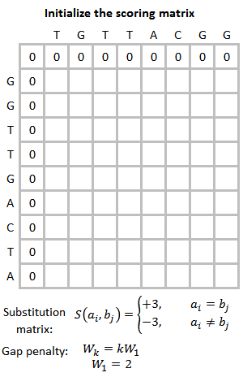
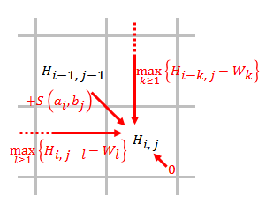
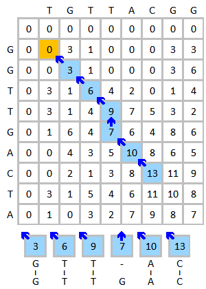

# Smith-Waterman algorithm \(SW\)

Smith-Waterman  알고리즘은 단백질 시퀀스간의 유사도를 계산하는데 가장 일반적인 방법이다. 일반적으로 사용되는 [Longest Common Subsequence Problem \(LCS\)](https://en.wikipedia.org/wiki/Longest_common_subsequence_problem)을 단백질 서열에 적용시켰다고 생각하면 쉽다.

LCS는 그냥 일반적인 다이나믹 프로그래밍이라고 생각하면 되는데, $$n$$ 길이를 가진 단백질 $$a$$ 와 $$m$$ 길이를 가진 단백질 $$b$$ 를 가진 단백질 사이에 매칭되는 가장 큰 subsequence를 구하고, 유사한 정도를 구하는 문제라고 생각하면된다.

## 알고리즘

먼저 $$(n \times m)$$ 크기를 가진 매트릭스 $$H$$ 를 만든다.



$$H_{k,0}, H_{0,l}$$  의 값을 다 0으로 초기화 시킨다.

행렬의 왼쪽 위부터 다음과 같은 식을 통해 채워나간다. \(따라서 전형적인 다이나믹 알고리즘이라고 볼 수 있다.\)

$$
H_{i,j}=\max\left\{\begin{matrix}
H_{i-1, j-1} + s(a_i, b_j) \\ 
\max_{k\geq1}\{H_{i-k,j}-W_k\} \\ 
\max_{l\geq1}\{H_{i,j-l}-W_k\} \\
  0
\end{matrix}\right. \ \ \ \ \ (1,\leq i \leq n, 1\leq j \leq m)
$$



위의 $$H_{i-1, j-1} + s(a_i, b_j)$$ 가 의미하는 것은 이전 매칭 결과에 현재 $$a_i,b_j$$ 의 매칭 스코어를 더한것인데, 일반적으로는 BLOSUM62같은 매트릭스부터 스코어를 사용한다. SW알고리즘상에서는 완전히 똑같이 매칭되지 않더라도 비슷한 아미노산 서열이라면 어느정도 높은 스코어를 주게 되고, 많이 다른 서열이면 - 값을 주게 된다. 이렇게 스코어를 매칭시킬 때, 계속 완전히 다른 서열이 매칭이 되어서 0보다 작아지게 되면 최대로 매칭되는 subsequence를 찾게 된다



이 때, $$\max_{k\geq1}\{H_{i-k,j}-W_k\} $$ 나 $$\max_{l\geq1}\{H_{i,j-l}-W_k\}$$를 살펴보자.  위의 $$(i-1, j-1)$$ 로부터 시작하는것이 아니라 $$(i-k,j)$$ 혹은 $$(i, j-l)$$ 에서 시작하는 것을 볼수 있고, $$W_k$$가 빼지는 것을 볼수 있다. $$W_k$$ 는 갭 패널티 \(Gap penalty\)인데,  $$k$$ 만큼의 갭에 대해서 빼지는 값이다. 갭 패널티는 유저가 정해주면 된다. 

```text
TACGGGCCCGCTA-C
||   | || ||| |
TA---G-CC-CTATC
```

이러한 케이스에서는 두 서열이 매칭이 되되, 매칭이 될때 이런식으로 중간 중간 갭이 생겨서 서열이 건너뛰어서 매칭 되는 것을 의미한다. 갭이 생긴다는 것은 $$\max_{k\geq1}\{H_{i-k,j}-W_k\} $$ 혹은 $$\max_{l\geq1}\{H_{i,j-l}-W_k\}$$ 이 0보다 크기때문에 매칭이 끊어지지 않고 갭을 만들면서 매칭이 된다는 것이다.

이런식으로 매트릭스의 모든 값을 채운 뒤에 최대값을 SW Score라고 부른다.

## 역추적 \(Traceback\)

먼저 $$H$$ 매트릭스 중, 가장 큰 값을 찾는다. 그곳으로 부터 역추적을 시작한다.

$$(i-1, j-1), (i-1, j), (i, j-1)$$ 중에 제일 큰 값을 찾아나가기 시작하고, 0을 만나면 추적을 멈춘다. 0을 만났다는 것은 매칭이 안되었다는 의미이기 때문이다.



$$(i-1, j)$$ 로 부터 온것은 $$a$$ 에 갭이 생겼다는 것을 의미하고, $$(i, j-1)$$ 로 부터 온것은$$b$$에 갭이 생겼다는 것을 의미한다. 이런식으로 역추적을 하면  최대값과 그에 해당하는 Maximum matching subsequence를 찾을 수 있다.

## Reference

1. Smith, Temple F., and Michael S. Waterman. "[Identification of common molecular subsequences.](http://cs.brown.edu/courses/cs181/resources/ch1_readings/Smith-Waterman-paper%202.pdf)" Journal of molecular biology 147.1 \(1981\): 195-197.

